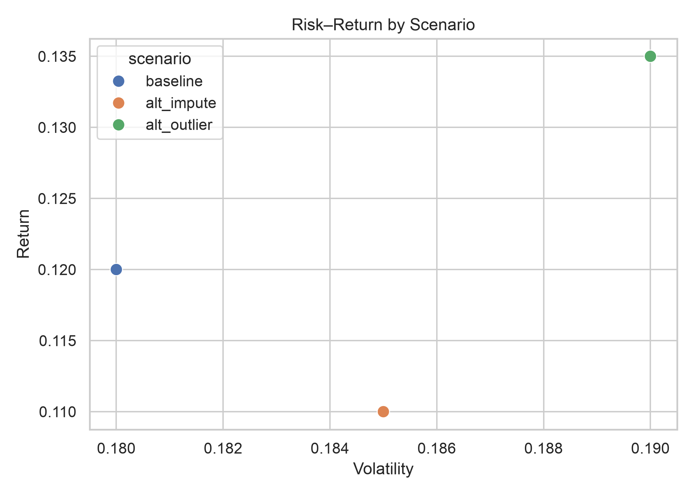
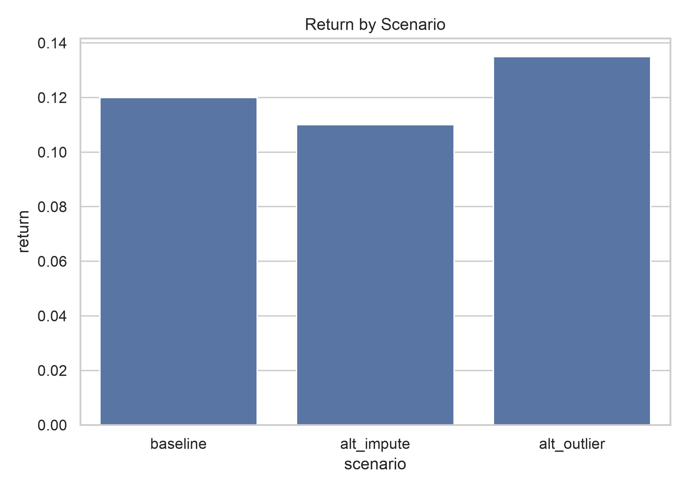
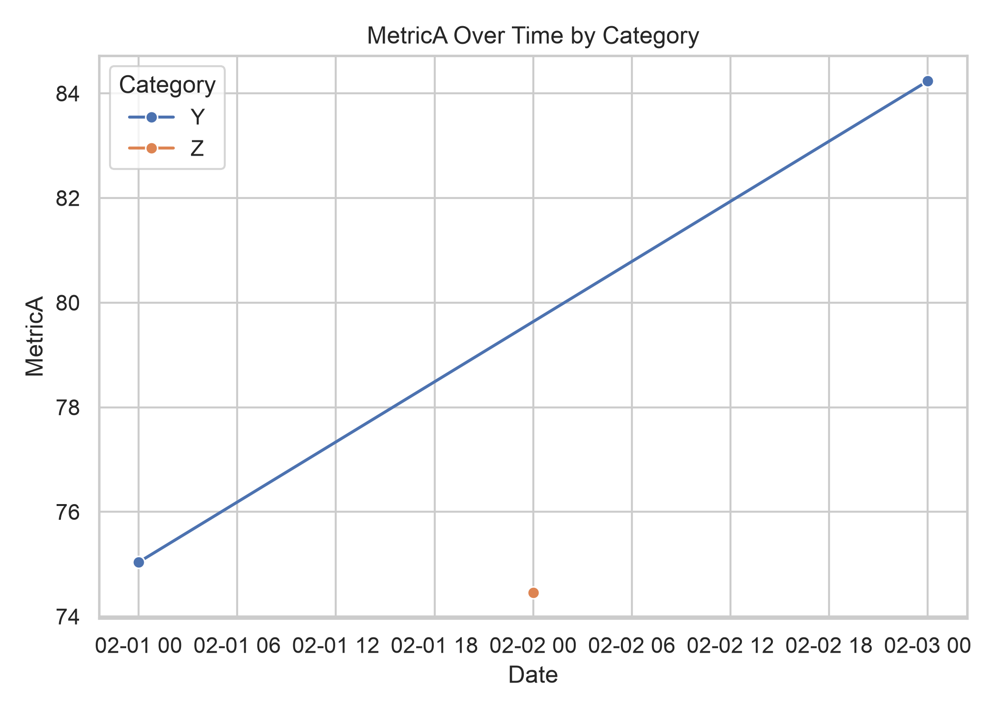

# Scenario Risk and Return - Stakeholder Report

## Executive Summary

- Use the baseline scenario as the planning case: 12.0% return with 18.0% volatility.
- Preprocessing assumptions move expected return from 11.0% to 13.5%, a 2.5 percentage-point range.
- The highest-return scenario also has the highest volatility, so it should not be treated as an automatic recommendation.

## Risk-Return Comparison

The alternate outlier scenario moves both return and volatility upward. The baseline provides the more conservative reference point because it does not depend on choosing the most favorable treatment.

## Return by Scenario

Alternate imputation lowers expected return to 11.0%, while the alternate outlier rule increases it to 13.5%. This 2.5 percentage-point spread quantifies preprocessing sensitivity.

## Monitoring View

MetricA changes across the three dates, but each category appears only once. This chart is illustrative and does not establish a persistent trend.

## Sensitivity Summary

| Assumption | Baseline return | Alternate return | Impact |
|---|---:|---:|---:|
| Fill nulls with median vs mean | 12.0% | 10.0% | -2.0 pp |
| Remove outliers using 3-sigma rule | 12.0% | 14.0% | +2.0 pp |

## Assumptions and Risks

- Results use a synthetic three-scenario dataset and are not investment forecasts.
- Return and volatility estimates depend on imputation and outlier-treatment choices.
- Three observations are insufficient for statistical inference or stable time-series conclusions.
- The analysis does not include transaction costs, liquidity constraints, or changing market regimes.

## What This Means for You

Use the baseline for planning and treat alternate scenarios as bounds on model risk. Do not increase exposure solely because one treatment reports a higher return. Validate the analysis on real holdout data, document the selected preprocessing rule, and monitor volatility and scenario drift before acting.
