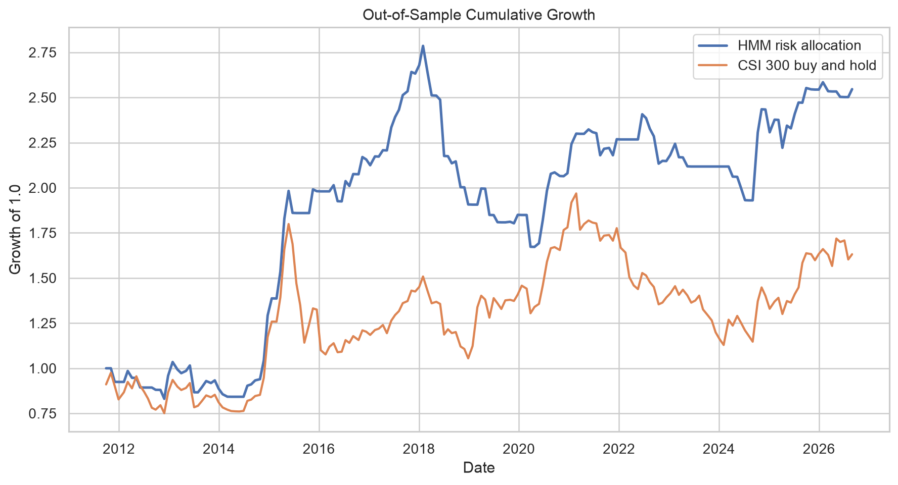
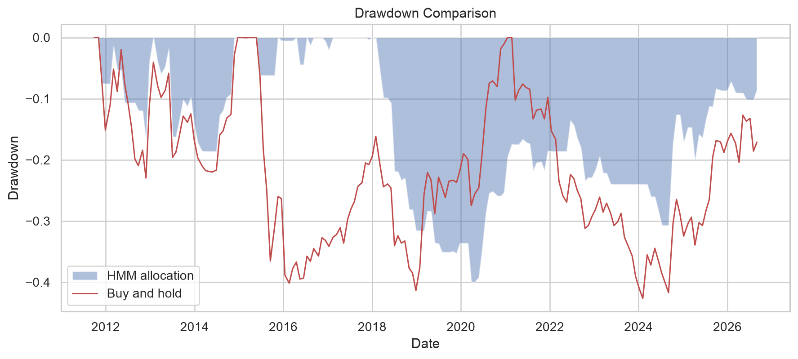
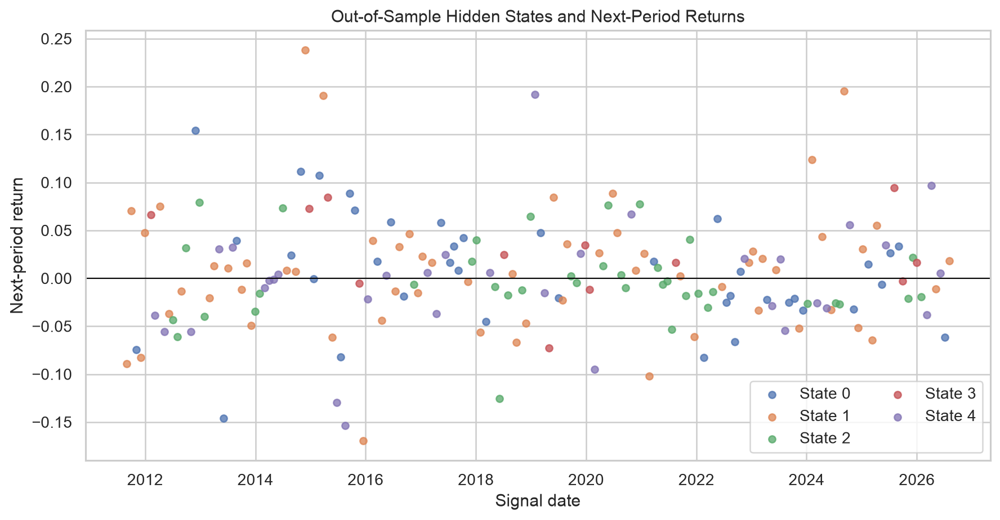
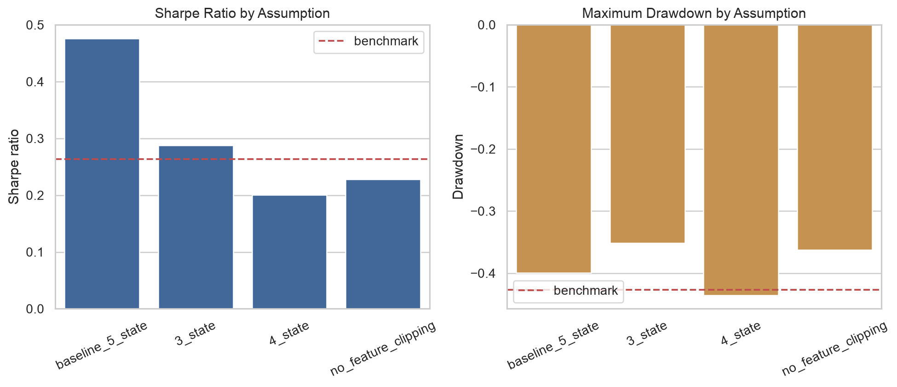
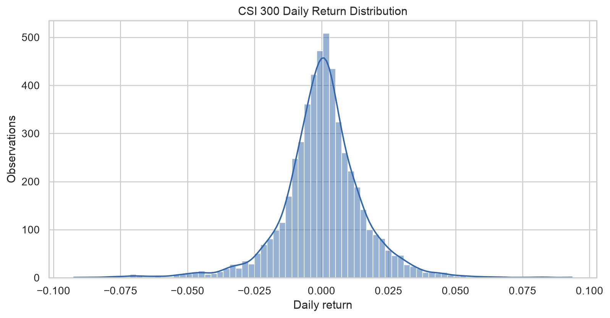
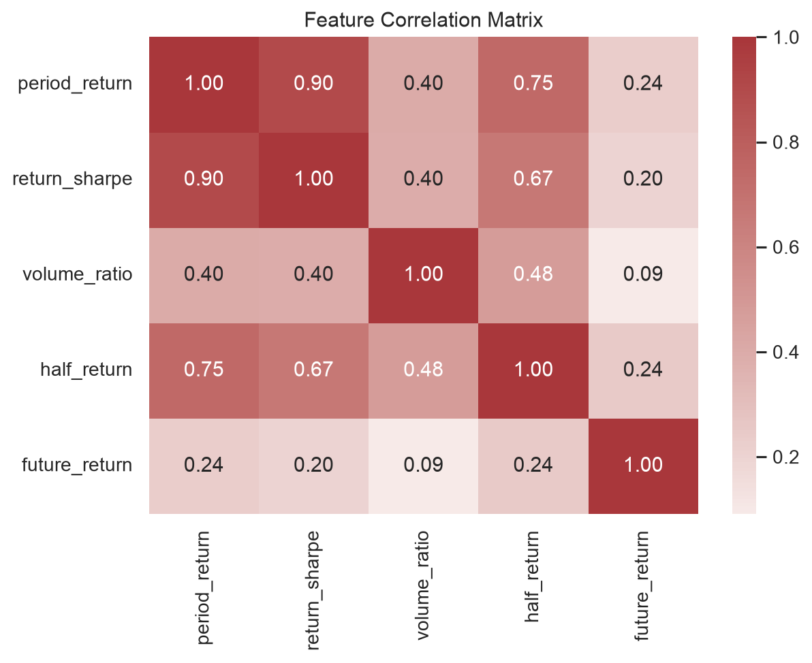

# CSI 300 Hidden-State Risk Allocation

## Executive Decision Summary

The five-state Hidden Markov Model candidate improved historical risk-adjusted performance versus CSI 300 buy-and-hold, but the active-return confidence interval includes zero and the result changes materially under alternate assumptions. The committee should **continue the signal in shadow mode** and should **not authorize live allocation from this evidence alone**.

For 182 out-of-sample 20-day periods from 2011-09-01 through 2026-08-31:

- Candidate annualized return: **6.68%**; buy-and-hold: **3.45%**.
- Candidate Sharpe ratio: **0.48**; buy-and-hold: **0.26**.
- Candidate maximum drawdown: **-39.98%**; buy-and-hold: **-42.64%**.
- Direction accuracy: **54.95%**; invested exposure: **62.09%**.
- Mean active 20-day return: **0.17%**, bootstrap 95% interval **-0.41% to 0.74%**.

## Problem and Method

The decision is whether to maintain full CSI 300 exposure or move to cash for the next 20 trading days. Four trailing measurements describe market direction, risk-adjusted direction, participation, and short-window acceleration. A rolling five-state Gaussian HMM classifies the current feature combination. Each state's forward-return history, calculated only from the rolling training sample, determines `risk_on` or `risk_off`.

The evaluation is chronological and walk-forward. Scaling and outlier bounds are learned only from prior observations. The model uses a rolling 100-observation window, refits every five signals, and pays 5 basis points whenever exposure changes.

## Historical Performance

The candidate's cumulative path exceeds the benchmark over the full test, but the advantage is not smooth. It should be read as one historical outcome under one documented specification.

The model reduces maximum drawdown by about 2.7 percentage points, a modest improvement rather than full crash protection. It still experiences a drawdown near 40%, so `risk_off` cannot be marketed as a capital-preservation guarantee.

## Hidden States and Prediction Quality

Hidden state numbers are arbitrary model labels. Their interpretation is rebuilt at each refit from training-window forward returns. The model's 54.95% direction accuracy is only moderately above chance; economic value therefore depends on which periods it avoids and on the cost assumption.

## Scenario and Sensitivity Analysis

| Scenario | Annual return | Sharpe | Maximum drawdown | Direction accuracy |
|---|---:|---:|---:|---:|
| Five states, training-only clipping | 6.68% | 0.48 | -39.98% | 54.95% |
| Three states | 3.55% | 0.29 | -35.13% | 52.20% |
| Four states | 2.04% | 0.20 | -43.55% | 52.20% |
| Five states, no feature clipping | 2.28% | 0.23 | -36.21% | 47.80% |

The five-state clipped specification is the strongest point estimate, but it is not uniformly best on every risk measure. The three-state model has the shallowest drawdown, and removing clipping materially reduces return and accuracy. Model complexity and outlier handling therefore affect the decision.

## Data and Feature Review

Daily returns have heavy tails, including genuine crisis observations. Valid extremes are retained and flagged rather than deleted. Training-only clipping is used for numerical stability and is explicitly tested as an assumption.

The 10-day and 20-day return features are related by construction. The model is not a causal explanation, and correlated features may influence inferred state geometry.

## Assumptions and Risks

- The CSI 300 price index omits dividends, and modeled cash earns zero.
- Five basis points per exposure switch is a simplified implementation cost.
- The binary full-index/cash decision ignores real portfolio constraints.
- HMM Gaussian and independence assumptions are approximations.
- State identities can permute after retraining.
- State count and outlier treatment create model-selection risk.
- The bootstrap active-return interval includes zero.
- Public data may change, and the local API is not production-hardened.

## Recommendation and Next Steps

1. Run the signal in shadow mode and timestamp forecasts before outcomes occur.
2. Pre-register the next forward-evaluation window and decision thresholds.
3. Validate prices against a licensed source and use a dividend-aware benchmark.
4. Replace simplified costs and zero cash yield with implementable assumptions.
5. Monitor data, model, system, and business thresholds in `docs/monitoring_plan.md`.
6. Require risk-chair approval before the output affects capital.

The signal is promising enough to continue studying, but not strong or stable enough for immediate deployment.
